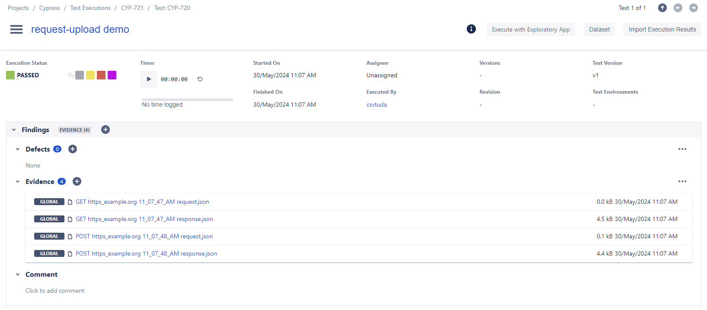

# Request Upload Demo Project

This is a demo project to teach how to use the `cy.request` command in Cypress in conjunction with the [cypress-xray-plugin](https://www.npmjs.com/package/cypress-xray-plugin).

## Prerequisites

- Node.js (version >= 18)
- npm or yarn

## Installation

1. Clone the repository:

    ```sh
    git clone https://github.com/Qytera-Gmbh/cypress-xray-plugin-examples
    cd cypress-xray-plugin-examples/request-upload
    ```

2. Install dependencies:

    ```sh
    npm install
    ```

    or

    ```sh
    yarn install
    ```

3. Modify `cypress.config.ts` as needed or create a [`.env`](https://www.npmjs.com/package/dotenv) file:

    ```sh
    # Authentication: https://qytera-gmbh.github.io/projects/cypress-xray-plugin/section/configuration/authentication/
    XRAY_CLIENT_SECRET=...
    XRAY_CLIENT_ID=...
    JIRA_API_TOKEN=...
    JIRA_USERNAME=...
    JIRA_PASSWORD=...

    JIRA_PROJECT_KEY=...
    JIRA_URL=...
    ```

4. Change the issue key in `request-upload\cypress\e2e\spec.cy.ts` to your project's issue key, e.g.:

    ```diff
    - it("CYP-720 passes", () => {
    + it("PRJ-42 passes", () => {
    ```

## Running Tests

To run the tests, use the following command:

```sh
npx cypress run
```

The plugin should then upload the requests' data:

```console
[...]
│ Cypress Xray Plugin │ INFO    │ Uploading native Cypress test results...
│ Cypress Xray Plugin │ SUCCESS │ Uploaded test results to issue: CYP-721 (https://qualitymaster.atlassian.net/browse/CYP-721)
```

